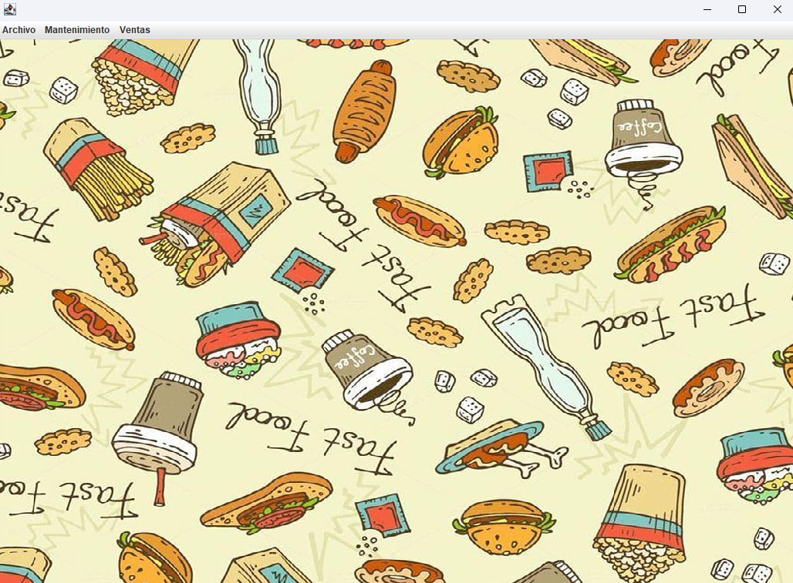
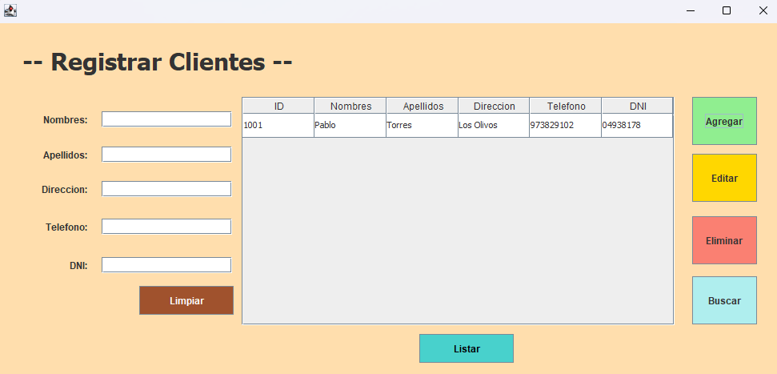
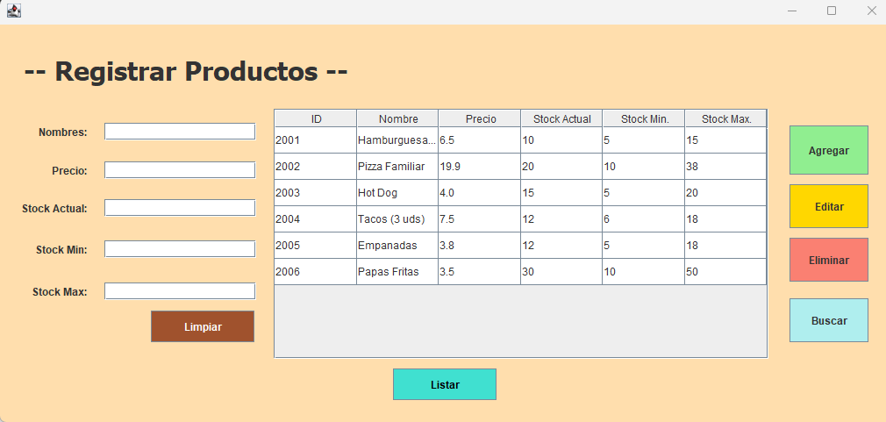
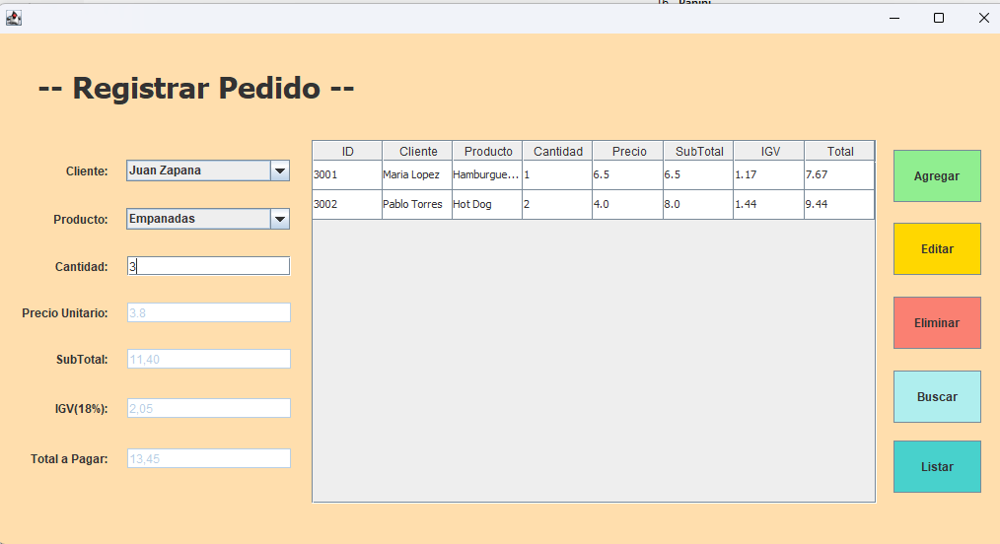

# 🍔 Aplicación de Gestión de Comida Rápida en Java – Manejo de Clientes, Productos y Pedidos con Archivos TXT

## 📜 Descripción
Esta es una aplicación de gestión de comida rápida desarrollada en **Java** con interfaz gráfica (Swing), sin el uso de bases de datos.  
Los datos se almacenan en **archivos TXT**, permitiendo la gestión de clientes, productos y pedidos de manera sencilla.

---

## 🚀 Características
✔ **Gestión de Clientes** – Agregar, editar, eliminar y listar clientes.  
✔ **Gestión de Productos** – Registrar, modificar y eliminar productos disponibles.  
✔ **Gestión de Pedidos** – Agregar pedidos, calcular subtotal, IGV y total a pagar.  
✔ **Persistencia de Datos** – Los registros se guardan en archivos de texto:  
   - `clientes.txt`  
   - `productos.txt`  
   - `pedidos.txt`  

---

## 🛠 Tecnologías utilizadas
- **Java** (Swing para la interfaz gráfica)  
- **Archivos TXT** para el almacenamiento de datos  

---

## 🖼 Capturas de Pantalla  
### 📌 Pantalla Principal  
  

### 📌 Gestión de Clientes  
  

### 📌 Gestión de Productos  
  

### 📌 Gestión de Pedidos  
  

